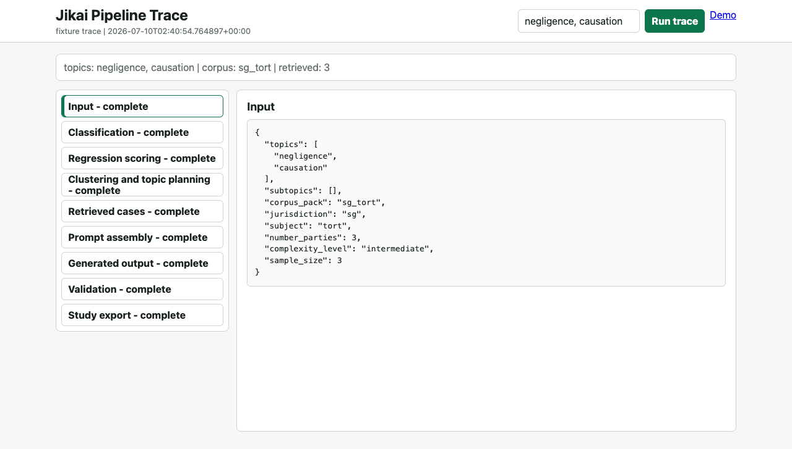
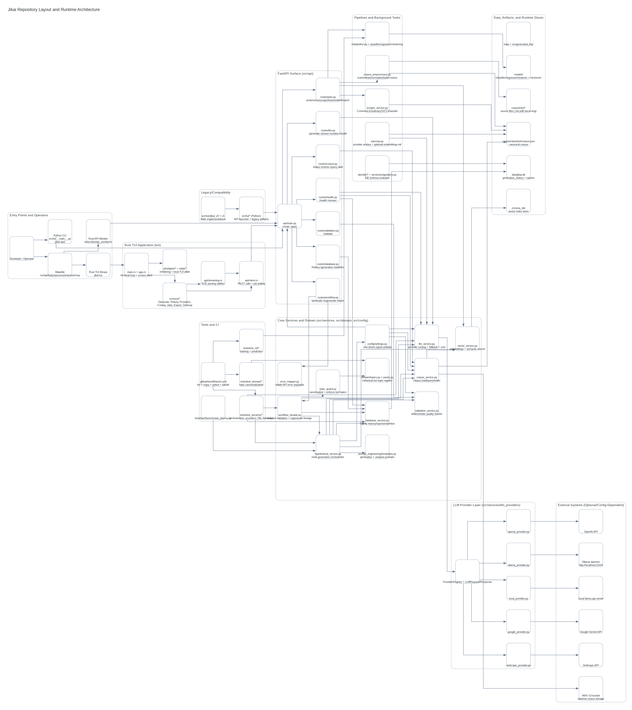

# `Jikai`

Open-source infrastructure for AI-generated common-law exam-question practice.
Jikai generates legal hypotheticals and model answers with an ML foundation stage before LLM drafting, so topic selection, retrieval, quality scoring, and validation constrain the final output instead of leaving generation as a raw prompt.
It is built for law students, educators, and legal-tech builders who want local-first practice-question generation, corpus-backed retrieval, validation gates, and exportable study artifacts.
Current corpus: Singapore Tort. Pivot target: SG + UK + US Tort corpus packs, with SG Tort as the reference pack.
Try it locally with `make env-setup`, `make dev-setup`, and `make run`.
Hosted demo status: public URL not provisioned; deployment runbook is [`docs/deployment/hosted-demo.md`](docs/deployment/hosted-demo.md).

[](https://github.com/gongahkia/jikai/releases/tag/1.0.0)
[](https://github.com/gongahkia/jikai/releases/tag/2.0.0)
[](https://github.com/gongahkia/jikai/releases/tag/3.0.0)


> [!IMPORTANT]
> Please read through [this disclaimer](#disclaimer) before using [Jikai](https://github.com/gongahkia/jikai).

## Why It Exists

Jikai is not a chatbot wrapper. It is a local-first generation pipeline whose design goal is reproducible practice volume: generate a grounded fact pattern, inspect whether it covered the requested doctrine, then export it into a study workflow.

## Pipeline Walkthrough

```mermaid
flowchart LR
  A[Request<br/>corpus pack, jurisdiction, topics] --> B[Scope guard<br/>topic taxonomy + corpus pack]
  B --> C[ML foundation<br/>classifier + regressor + clusterer]
  C --> D[Planning<br/>topic selector + structural planner]
  D --> E[Retrieval<br/>semantic search or corpus overlap]
  E --> F[Prompt assembly<br/>shared template + jurisdiction overlay]
  F --> G[LLM draft<br/>provider gateway]
  G --> H[Validation<br/>topic, party, realism, similarity]
  H --> I[Study artifacts<br/>model answer, history, reports, exports]
```



The diagram is maintained directly in this README. Update it with the stage owners below when the code path changes.



| Stage | What It Constrains | Code |
|-------|--------------------|------|
| Scope guard | Corpus pack, jurisdiction, subject, topic aliases | `src/domain/packs.py`, `src/services/topic_guard.py` |
| ML foundation | Topic prediction, quality scoring, diversity cluster | `src/ml/pipeline.py`, `src/ml/classifier.py`, `src/ml/regressor.py`, `src/ml/clustering.py` |
| Planning | Topic-ranked examples and fact-pattern skeleton | `src/ml/topic_selector.py`, `src/ml/structural_planner.py`, `src/services/hypo_generator.py` |
| Retrieval | SG Tort examples, vector metadata, fallback overlap search | `src/services/vector_service.py`, `src/services/corpus_service.py` |
| Prompt assembly | Common-law base prompt plus selected jurisdiction overlay | `src/services/prompt_engineering/templates.py`, `corpus/packs/sg_tort/manifest.json` |
| LLM draft | Provider/model routing, health, fallback, streaming | `src/services/llm_service.py`, `src/services/llm_providers/` |
| Validation | Required topics, party count, jurisdiction context, realism gate, similarity | `src/services/validation_service.py`, `src/services/hypothetical_service.py` |
| Artifacts | History, feedback, DOCX/PDF, Anki TSV | `src/services/database_service.py`, `src/services/export_service.py` |

### Example Pipeline Artifact

The shortened fixture below shows the shape of one SG Tort run. It is documentation data, not benchmark evidence.

```json
{
  "input": {
    "corpus_pack": "sg_tort",
    "jurisdiction": "sg",
    "subject": "tort",
    "topics": ["negligence", "causation"],
    "number_parties": 3
  },
  "ml_foundation": {
    "topics": ["negligence", "causation"],
    "quality_score": 0.82,
    "is_diverse": true
  },
  "retrieved_grounding": [
    {
      "source": "corpus/labelled/sg_tort/corpus.json",
      "topics": ["negligence", "causation"],
      "jurisdiction": "sg"
    }
  ],
  "generated_excerpt": "In Singapore, Tan Wei Ming, a delivery rider, collided with a pedestrian outside a Marina Bay office tower after Bright Services Pte Ltd delayed repairing a known brake fault. The facts raise whether the company breached its duty of care and whether that breach caused the pedestrian's injury.",
  "validation": {
    "topic_inclusion": {
      "topics_found": ["negligence", "causation"],
      "coverage_ratio": 1.0
    },
    "jurisdiction_context": {
      "passed": true,
      "evidence": ["singapore", "marina bay"]
    },
    "quality_gate": {
      "passed": true,
      "failed_checks": []
    }
  }
}
```

## Feature Surface

* *ML-before-LLM orchestration*: `src/services/workflow_facade.py` blocks generation until the ML pipeline is trained or bootstrapped.
* *Common-law corpus direction*: SG Tort ships now; UK and US Tort are planned as first-class corpus packs after source/licensing review.
* *Local-first LLM path*: Ollama is the default provider, with OpenAI, Anthropic, Gemini, and local llama.cpp-compatible servers available by configuration.
* *RAG and validation*: Chroma-backed semantic retrieval, deterministic topic/party/realism checks, optional Legal-BERT embeddings, and optional LLM validation.
* *Study workflow outputs*: model answers, generation reports, batch generation, DOCX/PDF export, and Anki TSV export.
* *Usable surfaces*: FastAPI REST endpoints, async jobs, and a Rust TUI for local operators.

## How To Read This Repo

Jikai is organized around the generation pipeline and the supporting corpus/runtime layers.

| Area | Path | Audience |
|------|------|----------|
| Generation pipeline | `src/services/`, `src/ml/`, `src/domain/` | maintainers, legal-tech builders |
| FastAPI backend | `src/api/` | API users, deployers |
| Corpus and evals | `docs/`, `corpus/`, `src/evals/` | contributors, researchers |
| Rust TUI | `tui/` | terminal-first local operators |

## Stack

* *Backend/API*: [Python 3.12 or 3.13](https://www.python.org/), [FastAPI](https://fastapi.tiangolo.com/), [Uvicorn](https://www.uvicorn.org/), [Pydantic](https://docs.pydantic.dev/), [pydantic-settings](https://docs.pydantic.dev/latest/concepts/pydantic_settings/)
* *TUI*: [Rust](https://www.rust-lang.org/), [ratatui](https://ratatui.rs/), [crossterm](https://docs.rs/crossterm/), [tokio](https://tokio.rs/), [reqwest](https://docs.rs/reqwest/)
* *LLM Provider Layer*: [Ollama](https://ollama.ai/), [OpenAI](https://openai.com/), [Anthropic](https://www.anthropic.com/), [Google Gemini](https://ai.google.dev/), [Local LLM](https://github.com/ggerganov/llama.cpp) via llama.cpp server
* *ML Foundation*: [scikit-learn](https://scikit-learn.org/), [pandas](https://pandas.pydata.org/), [PyTorch](https://pytorch.org/), [Transformers](https://huggingface.co/docs/transformers/)
* *Retrieval/Embeddings*: [Sentence Transformers](https://www.sbert.net/), [ChromaDB](https://www.trychroma.com/)
* *Data/Persistence*: [SQLite](https://www.sqlite.org/) (`data/jikai.db`), JSON corpus (`corpus/labelled/sg_tort/corpus.json`), Chroma persistent store (`./chroma_db`)
* *Corpus Ingestion/Export*: [BeautifulSoup4](https://www.crummy.com/software/BeautifulSoup/), [lxml](https://lxml.de/), [httpx](https://www.python-httpx.org/), [PyMuPDF](https://pymupdf.readthedocs.io/), [python-docx](https://python-docx.readthedocs.io/), [Pillow](https://pillow.readthedocs.io/), [pytesseract](https://pypi.org/project/pytesseract/)
* *Observability/Logging*: [structlog](https://www.structlog.org/)
* *Quality Tooling*: [pytest](https://pytest.org/), [pytest-asyncio](https://pytest-asyncio.readthedocs.io/), [pytest-cov](https://pytest-cov.readthedocs.io/), [flake8](https://flake8.pycqa.org/), [mypy](http://mypy-lang.org/), [black](https://black.readthedocs.io/), [isort](https://pycqa.github.io/isort/)

## Quickstart

Requires [Python 3.12 or 3.13](https://www.python.org/), [Rust/Cargo](https://www.rust-lang.org/tools/install), and [Ollama](https://ollama.ai/) for the default local model path.

1. Create `.env` off of `env.example` and fill your API keys and configuration.

```console
$ make env-setup
```

2. Install dependencies and build the Rust TUI binaries.

```console
$ make dev-setup
```

3. Start local LLM runtime (default provider/model path).

```console
$ ollama serve
$ ollama pull llama2:7b
```

4. Launch `Jikai` using one of the runtime entry points below.

```console
$ make run                                # API + Rust TUI together
$ make api                                # API via Rust API monitor UI
$ python -m src.api --host 127.0.0.1 --port 8000  # API only (plain uvicorn runner)
$ make tui                                # Rust TUI only (requires API already running)
```

5. Generate an SG Tort hypothetical through the API.

```console
$ curl -s http://127.0.0.1:8000/workflow/generate \
  -H 'content-type: application/json' \
  -d '{"topics":["negligence","causation"],"number_parties":3,"user_preferences":{"include_model_answer":true}}' \
  | python3 -m json.tool
```

6. Export recent generations to Anki-compatible TSV.

```console
$ curl -s http://127.0.0.1:8000/jobs/export-anki \
  -H 'content-type: application/json' \
  -d '{"output_path":"data/export/anki_cards.tsv","include_model_answer":true}' \
  | python3 -m json.tool
```

7. Run data/model utility jobs as needed.

```console
$ make corpus-bronze # build corpus/manifest.json from corpus/raw/*
$ make corpus-silver # build corpus/normalized/<pack>/corpus.json
$ make corpus-gold   # build corpus/labelled/<pack>/corpus.json
$ make preprocess    # legacy clean-corpus rebuild path
$ make train      # train required ML models
$ make warmup     # preload corpus + probe provider health
$ make label      # append labelled examples to corpus/labelled/sample.csv
```

8. Check runtime health and quality gates.

```console
$ make health
$ make health-llm
$ make test
$ make lint
```

Inside the Rust TUI, `Chat` is the default landing screen with command-driven workflows.
Use `/menu` to open the multi-screen navigation, and `/help` to list command families (`hypo`, `regenerate`, `report`, `corpus`, `validation`, `jobs`, `providers`, `history`, `stats`, `settings`, `guided`, `label`).

## So where's the [ML](https://en.wikipedia.org/wiki/Machine_learning) in this?

`Jikai` uses ML for training/inference and post-draft topic gating.

* *Pipeline*: [`src/ml/pipeline.py`](src/ml/pipeline.py#L20) coordinates classifier, regressor, and clusterer training/inference.
* *SetFit gate*: [`src/ml/pipeline.py`](src/ml/pipeline.py#L44) can dispatch to the optional [`SetFitTopicClassifier`](src/ml/setfit_classifier.py#L23), then [`gate_confidence`](src/ml/pipeline.py#L187) scores requested-topic coverage.
* *Generation gate*: [`_ml_gate_check`](src/services/hypothetical_service.py#L824) feeds topic confidence into the refine loop when `ml_assisted` or `hybrid` generation is active.
* *Retrieval eval*: LegalBench-RAG-style recall, MRR, and NDCG metrics are implemented in [`src/evals/evaluators.py`](src/evals/evaluators.py#L228) and reported as dry-run smoke metrics in [`research/results.md`](research/results.md).

## So where's the [LLM](https://en.wikipedia.org/wiki/Large_language_model) in this?

The LLM is the drafting and revision stage.

* *Provider routing*: [`LLMService.generate`](src/services/llm_service.py#L389) handles provider/model selection, timeout handling, circuit-breaker fallback, and cost tracking.
* *Structured drafts*: [`HypotheticalDraft`](src/services/prompt_engineering/schemas.py#L87) is produced through [`generate_structured`](src/services/llm_service.py#L470) and [`_generate_structured_draft`](src/services/hypothetical_service.py#L1173).
* *IRAC model answers*: [`ModelAnswer`](src/services/prompt_engineering/schemas.py#L107) is generated in [`_generate_model_answer`](src/services/hypothetical_service.py#L1618).
* *Refine loop*: [`RefineLoop`](src/services/refine_loop.py#L31) retries drafts when [`RefineCritique.is_blocking`](src/services/prompt_engineering/schemas.py#L166) flags topic, Faithfulness, citation, or rule-based failures.
* *Verification*: NLI Faithfulness and citation grounding live in [`nli_verifier.py`](src/services/verification/nli_verifier.py#L21) and [`citation_verifier.py`](src/services/verification/citation_verifier.py#L18).

## Architecture



## Model Support

`Jikai` uses a provider registry and initializes providers from environment configuration at startup.

| Provider | Enabled When | Default Model | Model List Source | Streaming | Notes |
|----------|--------------|---------------|-------------------|-----------|-------|
| `ollama` | Always attempted (uses `OLLAMA_HOST`) | `llama2:7b` (or `LLM_MODEL`) | Dynamic from Ollama `/api/tags` | Yes | Default local-first provider path |
| `openai` | `OPENAI_API_KEY` is set | `gpt-4o` | Dynamic from OpenAI `/v1/models` (fallback list on error) | Yes | Supports provider/model selection through `/llm/select-*` |
| `anthropic` | `ANTHROPIC_API_KEY` is set (and SDK available) | `claude-sonnet-4-5-20250929` | Static allow-list in provider module | Yes | Claude adapter supports system prompts |
| `google` | `GOOGLE_API_KEY` is set (and SDK available) | `gemini-2.0-flash` | Static allow-list in provider module | Yes | Gemini adapter supports system prompts |
| `local` | `LOCAL_LLM_HOST` is set | `local` | Dynamic from `/v1/models` on local server (fallback to `local`) | Yes | Intended for llama.cpp/OpenAI-compatible local endpoints |

## API

`Jikai`'s REST API is served at `http://localhost:8000`. Interactive docs are available at `/docs` when `API_DEBUG=true`.

| Method | Endpoint | Description |
|--------|----------|-------------|
| `GET` | `/health` | Health check across all services |
| `GET` | `/version` | Service version info |
| `POST` | `/chat/interpret` | Parse natural language into structured chat command intent |
| `POST` | `/workflow/generate` | Generate a legal hypothetical |
| `POST` | `/workflow/regenerate` | Regenerate from a previous generation |
| `POST` | `/workflow/report` | Submit a quality report for a generation |
| `GET` | `/workflow/reports/{generation_id}` | List reports for a generation |
| `POST` | `/workflow/batch-generate` | Generate multiple hypotheticals with topic coverage |
| `GET` | `/corpus/topics` | List all available tort-law topics |
| `GET` | `/corpus/entries` | Fetch corpus entries (`topic`, `limit` query params supported) |
| `POST` | `/corpus/query` | Query corpus by topics with semantic search |
| `POST` | `/corpus/add` | Add a new entry to the corpus |
| `GET` | `/corpus/health` | Corpus service health check |
| `GET` | `/llm/health` | Check LLM provider health (`provider` query param optional) |
| `GET` | `/llm/models` | List available models per provider (`provider` query param optional) |
| `POST` | `/llm/generate` | Direct LLM generation |
| `POST` | `/llm/stream` | Streaming LLM generation (SSE) |
| `POST` | `/llm/select-provider` | Switch the active LLM provider |
| `POST` | `/llm/select-model` | Switch the active model |
| `GET` | `/llm/session-cost` | Get session token usage and cost |
| `GET` | `/db/history` | Fetch generation history (`limit` query param supported) |
| `GET` | `/db/generation/{generation_id}` | Get a specific generation |
| `GET` | `/db/count` | Get total generation count |
| `GET` | `/db/statistics` | Generation statistics from the SQLite database |
| `GET` | `/db/reports/{generation_id}` | Get reports for a generation |
| `POST` | `/validation/validate` | Validate a hypothetical against required topics |
| `POST` | `/jobs/preprocess` | Preprocess raw corpus files (async job) |
| `POST` | `/jobs/scrape` | Scrape cases from legal databases (async job) |
| `POST` | `/jobs/train` | Train ML pipeline models (async job) |
| `POST` | `/jobs/embed` | Embed corpus into vector store (async job) |
| `POST` | `/jobs/export` | Export a generation artifact (DOCX path by default) |
| `POST` | `/jobs/export-training-data` | Export approved generations as ML training data |
| `POST` | `/jobs/export-anki` | Export generations as Anki-compatible TSV |
| `POST` | `/jobs/cleanup` | Clean up data targets (async job) |
| `POST` | `/jobs/label` | Append labelled entries to training corpus CSV |
| `GET` | `/jobs/{job_id}/status` | Poll async job status |
| `POST` | `/jobs/{job_id}/cancel` | Cancel a running job |

## Corpus Roadmap

SG Tort is the current reference corpus. The pivot path is:

1. Add first-class jurisdiction, subject, topic, and subtopic fields.
2. Keep SG Tort on the bronze/silver/gold corpus pipeline.
3. Add UK and US Tort packs only after source terms and redistribution constraints are documented.
4. Use the blind-evaluation rubric in [`docs/evals/blind-eval-rubric-v1.md`](docs/evals/blind-eval-rubric-v1.md) before generating comparison samples.
5. Keep public comparison claims out of the README until blind evaluation artifacts support them.

## Disclaimer

All hypotheticals generated with [`Jikai`](https://github.com/gongahkia/jikai) are intended for educational and informational purposes only. They do not constitute legal advice and should not be relied upon as such.

### No Liability

By using this tool, you acknowledge and agree that:

1. The creator of this tool shall not be liable for any direct, indirect, incidental, consequential, or special damages arising out of or in connection with the use of the hypotheticals generated, including but not limited to any claims related to defamation or other torts.
2. Any reliance on the information provided by this tool is at your own risk. The creators make no representations or warranties regarding the accuracy, reliability, or completeness of any content generated.
3. The content produced may not reflect current legal standards or interpretations and should not be used as a substitute for professional legal advice.
4. You are encouraged to consult with a qualified legal professional regarding any specific legal questions or concerns you may have. Use of this tool signifies your acceptance of these terms.

## Research

[](research/results.md)
[](research/results.md)
[](research/results.md)
[](research/results.md)

These badges are dry-run smoke metrics from [`research/results.md`](research/results.md), not external benchmark claims.

The research notes cover [`methodology`](research/methodology.md), [`results`](research/results.md), [`related work`](research/related_work.md), and [`roadmap`](research/roadmap.md). The methodology links each architecture claim to concrete source anchors and covers the ML gate, LegalBench-RAG-style retrieval metrics, structured IRAC generation, NLI Faithfulness, citation grounding, and the refine loop.
