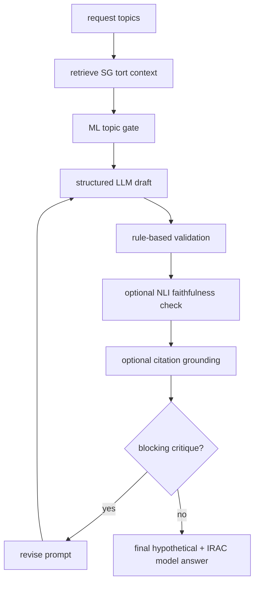

# Jikai Research Notes

## Executive Summary

Jikai is a staged SG tort hypothetical generator: retrieval and ML topic gating prepare the problem, structured LLM generation drafts the hypothetical and IRAC answer, then enabled validators check topic coverage, faithfulness, and citation grounding.

The current benchmark artifacts are dry-run smoke outputs, not external benchmark claims. The strongest recorded dry-run signal is `ollama` + `hybrid` + `refine` at `0.81` RAGAS-style faithfulness, sourced from [`docs/evals/results_v1.json`](../docs/evals/results_v1.json) and summarized in [`results.md`](results.md).

## Research Map

- [`methodology.md`](methodology.md): ML gate, NLI faithfulness, citation grounding, LegalBench-RAG-style retrieval metrics, IRAC model-answer generation, and refine loop.
- [`results.md`](results.md): dry-run benchmark tables from checked-in eval JSON.
- [`related_work.md`](related_work.md): LegalBench-RAG, LexRAG, LRAGE, Dahl 2024, Magesh 2025, RAGAS, TruLens, DeepEval, DSPy, SetFit, Instructor, and Outlines.
- [`roadmap.md`](roadmap.md): limitations and next validation steps.

## System Diagram

## Source Anchors

- ML pipeline and SetFit dispatch: [`src/ml/pipeline.py`](../src/ml/pipeline.py#L20), [`src/ml/setfit_classifier.py`](../src/ml/setfit_classifier.py#L23).
- ML gate consumed by generation: [`src/ml/pipeline.py`](../src/ml/pipeline.py#L187), [`src/services/hypothetical_service.py`](../src/services/hypothetical_service.py#L824).
- Structured generation schemas: [`src/services/prompt_engineering/schemas.py`](../src/services/prompt_engineering/schemas.py#L87), [`src/services/prompt_engineering/structured.py`](../src/services/prompt_engineering/structured.py#L10).
- Refine loop: [`src/services/refine_loop.py`](../src/services/refine_loop.py#L31), [`src/services/hypothetical_service.py`](../src/services/hypothetical_service.py#L883).
- Verification: [`src/services/verification/nli_verifier.py`](../src/services/verification/nli_verifier.py#L21), [`src/services/verification/citation_verifier.py`](../src/services/verification/citation_verifier.py#L18).
- Eval metrics and runners: [`src/evals/evaluators.py`](../src/evals/evaluators.py#L228), [`script/run_jikai_eval.py`](../script/run_jikai_eval.py#L173), [`script/run_ablations.py`](../script/run_ablations.py#L23).
