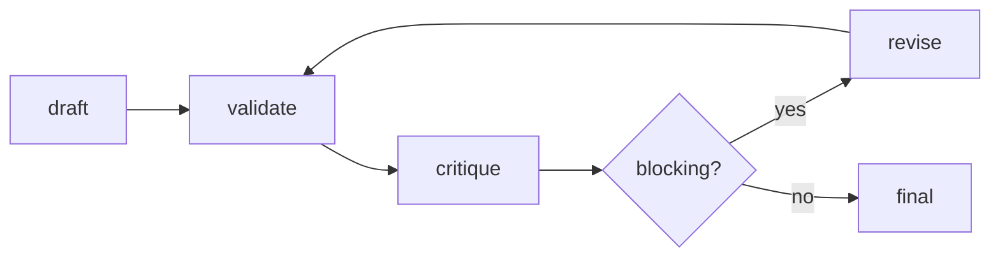

# Methodology

## Pipeline

Jikai uses a staged generation path. The ML pipeline coordinates classifier, regressor, and clusterer components in [`src/ml/pipeline.py`](../src/ml/pipeline.py#L20). The optional SetFit backend is wired behind the pipeline dispatch flag in [`src/ml/pipeline.py`](../src/ml/pipeline.py#L44) and implemented in [`src/ml/setfit_classifier.py`](../src/ml/setfit_classifier.py#L23).

Generation uses retrieved corpus context before the LLM draft path. [`HypotheticalService.generate_hypothetical`](../src/services/hypothetical_service.py#L560) prepares context, drafts a hypothetical, validates it, and can generate a model answer. The LLM provider abstraction handles provider selection, circuit-breaker fallback, timeout handling, and cost tracking in [`src/services/llm_service.py`](../src/services/llm_service.py#L389).

## ML Gate

The ML gate checks whether a draft covers requested topics after generation. The gate uses [`MLPipeline.gate_confidence`](../src/ml/pipeline.py#L187) and is called from [`HypotheticalService._ml_gate_check`](../src/services/hypothetical_service.py#L824). If the gate is enabled and the method is `ml_assisted` or `hybrid`, the refine loop receives the gate report through [`HypotheticalService._run_refine_loop`](../src/services/hypothetical_service.py#L883).

[Inference] The gate is a precision control layer, not a full legal correctness proof, because it checks topic confidence and delegates legal validity to other validators.

## Structured Generation

Structured draft and answer schemas live in [`src/services/prompt_engineering/schemas.py`](../src/services/prompt_engineering/schemas.py#L87). The structured adapter validates provider output against a Pydantic schema in [`src/services/prompt_engineering/structured.py`](../src/services/prompt_engineering/structured.py#L10), and [`LLMService.generate_structured`](../src/services/llm_service.py#L470) routes that call through the active provider.

The hypothetical draft path attempts structured generation first in [`_generate_hypothetical_draft`](../src/services/hypothetical_service.py#L1157). The model-answer path uses the `ModelAnswer` schema and IRAC prompt in [`_generate_model_answer`](../src/services/hypothetical_service.py#L1618).

## NLI Faithfulness

Faithfulness verification is implemented by [`NLIFaithfulnessVerifier`](../src/services/verification/nli_verifier.py#L21). It extracts claims, compares them against retrieved context with an NLI model when available, and returns a [`FaithfulnessReport`](../src/services/prompt_engineering/schemas.py#L135).

The refine loop treats faithfulness below `0.7` as blocking through [`RefineCritique.is_blocking`](../src/services/prompt_engineering/schemas.py#L166). [Inference] This can reduce unsupported factual drift when the verifier is enabled and context is available.

## Citation Grounding

Citation grounding is implemented by [`CitationVerifier`](../src/services/verification/citation_verifier.py#L18). It checks structured model-answer citations against corpus IDs and authority IDs, loading authority metadata from [`corpus/packs/sg_tort/authorities.json`](../corpus/packs/sg_tort/authorities.json) through [`_load_authorities`](../src/services/verification/citation_verifier.py#L78).

The model-answer path calls citation verification in [`_verify_model_answer_citations`](../src/services/hypothetical_service.py#L1732). Citation accuracy is one of the eval metrics in [`src/evals/evaluators.py`](../src/evals/evaluators.py#L317).

## Retrieval Metrics

The eval suite includes LegalBench-RAG-style retrieval metrics: recall at k, MRR, and NDCG in [`src/evals/evaluators.py`](../src/evals/evaluators.py#L228). The runners assemble benchmark outputs in [`script/run_jikai_eval.py`](../script/run_jikai_eval.py#L173) and ablations in [`script/run_ablations.py`](../script/run_ablations.py#L23).

LegalBench-RAG evaluates legal RAG retrieval using precise relevant text spans and deterministic retrieval scoring: <https://arxiv.org/abs/2408.10343>, <https://github.com/zeroentropy-ai/legalbenchrag>. Jikai's current checked-in metrics follow that retrieval-eval shape but are dry-run smoke outputs, not LegalBench-RAG results.

## Refine Loop

[`RefineLoop`](../src/services/refine_loop.py#L31) runs bounded validation and revision iterations. It gathers rule-based validation, optional NLI faithfulness, optional citation checks, and optional ML gate reports; [`RefineCritique.is_blocking`](../src/services/prompt_engineering/schemas.py#L166) decides whether another revision is needed.

